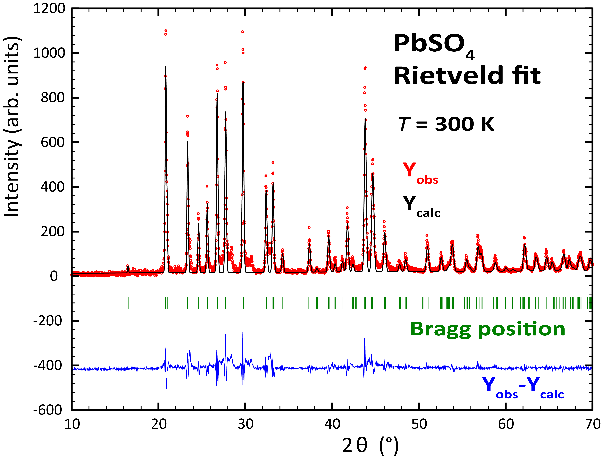
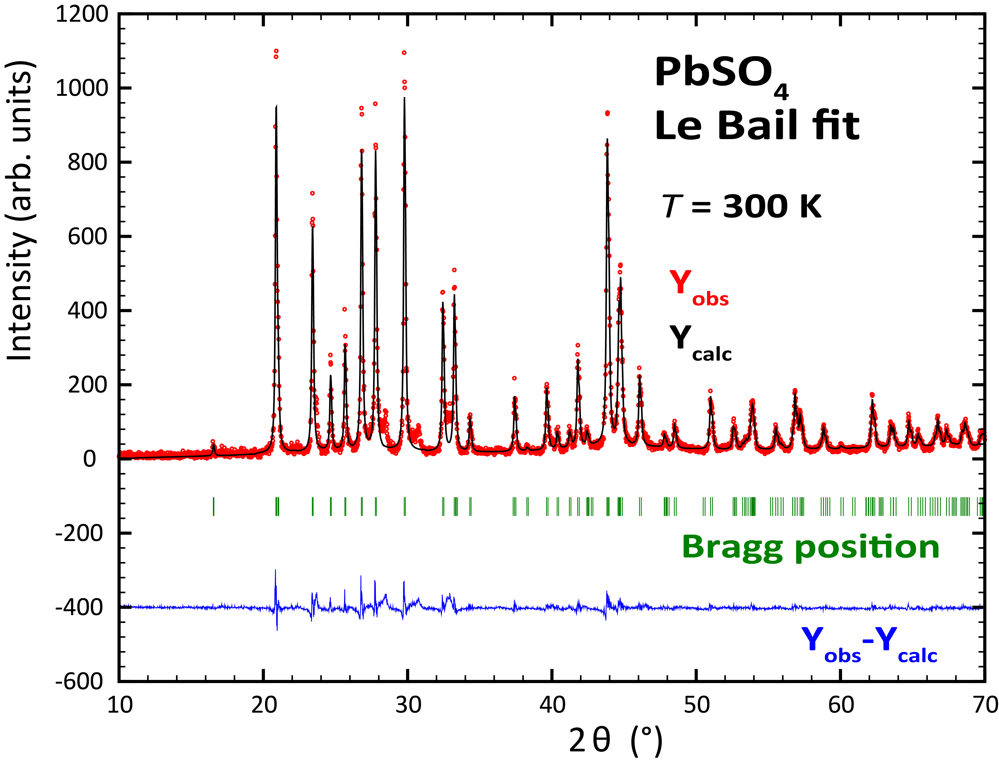

# Project: LK99 - replication attempt

Team: 
 - Ross Colman (https://kfkl.mff.cuni.cz/en/people/colman)
    - Crystal growth, project head
 - Petr Cermak (@petrscience, https://cermak.science/)
    - Data evaluation, Twitter communication
 - Nikolaos Biniskos (https://kfkl.mff.cuni.cz/en/people/biniskos)
    - Data evaluation, consultation

## Growth process

### 2nd August 2023

17:00 Copper and Phosphorus powder mised in 3:1 ratio and putted to the oven for 2 days. *T* = 550 °C

### 3rd August 2023

7:00 We were too impatient to wait for PbSO4 delivery, so prepared some this morning.
PbO dissolved in nitric acid to create aqueous lead nitrate. Then precipitate out lead sulphate by adding sodium sulfate.

8:00 PbSO4 drying in the oven.

10:00 PbSO4 goes on XRD to check correct composition (see refinement bellow)

## Data analysis

### 4th August 2023

Data from XRD at room temperature on PbSO4 refined with Fullprof (Rietveld analysis) and Jana (Le Bail method).
 - Raw data: `/data/bruker/230803_PbSO4raw.dat`
 - Fullprof refinement: `/analysis/PbSO4-fullprof/`
 - Jana refinement: `/analysis/PbSO4-jana/`

**Resulting lattice parameters**
|          | a        | b        | c        |
|----------|----------|----------|----------|
| Rietveld | 8.465(1) | 5.396(1) | 6.952(1) |
| Le Bail  | 8.466(1) | 5.395(1) | 6.952(1) |

**Discussion**: There is clearly some impurity, but in a small amount (3 unindexed peaks around 2θ = 30°). Peak shape is not perfectly fitted, because of the big step in the data acquisition.

